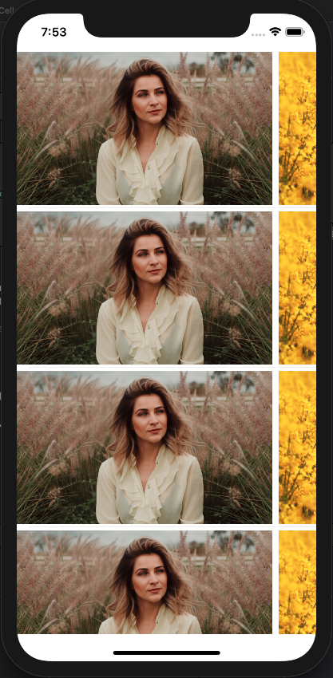

# BEKListKit

 It doesn't need to implement the UITableViewDataSource or UIColletionViewDataSource inside your view class. It also compatible with XIB contain cells or the programmatically implemented cells.
 
 
__-No need to Register Cell__

__-No need to set reuseIdentifier (Automatically created from your class name)__

__-No need to set or comfirm DataSource protocols__

__-Enhanced for MVVM structures__

__-No need to deal with CollectionFlowLayout__

__-Both UITableView and UICollectionView supported__


[](https://travis-ci.org/behrad-kzm/BEKListKit)
[](https://cocoapods.org/pods/BEKListKit)
[](https://cocoapods.org/pods/BEKListKit)
[](https://cocoapods.org/pods/BEKListKit)

## Example

To run the example project, clone the repo, and run `pod install` from the Example directory first.

## Requirements

iOS 9.3+
Xcode 11
Swift 5.0

## Installation

BEKListKit is available through [CocoaPods](https://cocoapods.org). To install
it, simply add the following line to your Podfile:

```ruby
pod 'BEKListKit'
```
 
## Demo

This is a tableView contains some collectionViews as tableCell.
The TableView made in 3 lines of code.
and the CollectionView made in just 4 lines.

Download the project and check the example



## Example

__usage:__

__Table Configuration:__

Set BEKMultiCellTable to the table's class.

```swift

    @IBOutlet weak var tableView: BEKMultiCellTable!

```

__TableCell Configuration:__
Make your custom cell confirms the BEKBindableCell protocol.

```swift

  extension MyCustomCell: BEKBindableCell {    
    typealias ViewModeltype = NewContactViewModel
    func bindData(withViewModel viewModel: NewContactViewModel) {
        titleLabel.text = viewModel.nameText
        profileImage.image = viewModel.profileImage
        newProfileImage.image = viewModel.extraImage
    }
}

```

__Create and push BEKGenericCell:__

Create a BEKGenericCell with a UITableViewCell base Class and pass it's viewModel.
```swift

  tableView.push(cell: BEKGenericCell.Table<MyCustomCell>(viewModel: viewModel))

```

Or a BEKGenericCell with a UICollectionViewCell base Class and pass it's viewModel.
```swift

  tableView.push(cell: BEKGenericCell.Collection<MyCustomCell>(viewModel: viewModel))

```

__CollectionLayout Composer:__

Use BEKCollectionLayoutComposer to set layout to your collectionView.

```swift

  collectionView.collectionViewLayout = BEKCollectionLayoutComposer.makeLayout(ForItemSize: bounds.size, scrollDirection: .horizontal)

```


## Installation
```

  pod 'BEKListKit'

```


## Author
Behrad Kazemi, Behradkzm@gmail.com, bekapps.com
<a href="https://bekapps.com"> Visit Web Site </a>
## License

BEKCurveTabbar is available under the MIT license. See the LICENSE file for more info.

